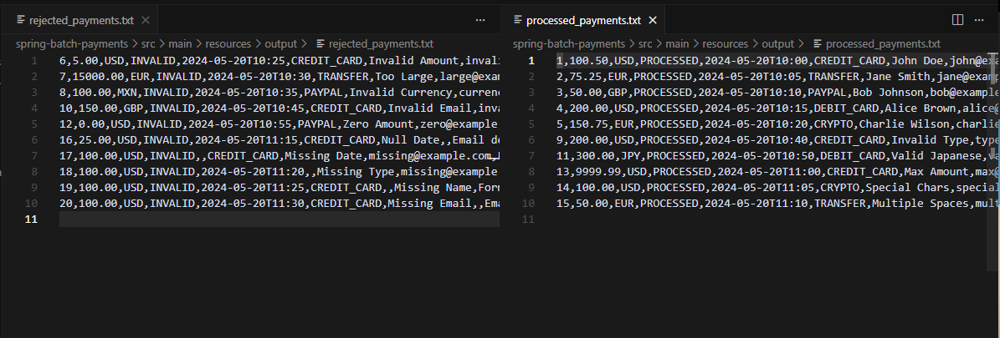

<div align = "center">
  
</div>

# Spring Batch Payments Processor

Este proyecto implementa un procesador de pagos usando Spring Batch que valida y procesa pagos desde un archivo de entrada, generando archivos de salida para pagos procesados, rechazados y un reporte general.

## Características

- Procesamiento de pagos en lotes
- Validación de montos, monedas y datos del cliente
- Cálculo de comisiones
- Generación de reportes
- Manejo de errores y pagos rechazados
- Soporte para múltiples monedas (USD, EUR, GBP, JPY)

## Requisitos

- Java 17 o superior
- Maven 3.6 o superior
- Spring Boot 2.7.0
- Spring Batch 4.3.6

## Configuración

El proyecto utiliza diferentes perfiles para desarrollo y producción. Para ejecutar en modo desarrollo:

```bash
mvn spring-boot:run -Dspring-boot.run.profiles=dev
```

## Estructura del Proyecto

```
src/main/java/com/example/batch/
├── config/         # Configuración de Spring Batch
├── model/          # Modelos de datos
├── processor/      # Procesadores de pagos
└── enums/          # Enumeraciones
```

## Flujo de Procesamiento

1. **Lectura de Pagos**: Lee pagos desde `input/payments.txt`
2. **Validación y Procesamiento**: 
   - Valida montos (mínimo: 10.00, máximo: 10000.00)
   - Valida monedas soportadas
   - Valida formato de email
   - Calcula comisiones
3. **Escritura de Resultados**:
   - Pagos válidos → `output/processed_payments.txt`
   - Pagos rechazados → `output/rejected_payments.txt`
   - Reporte general → `output/payment_report.txt`

## Formato de Archivos

### Archivo de Entrada (payments.txt)
```
id,amount,currency,status,paymentDate,paymentType,customerName,customerEmail
1,100.00,USD,PENDING,2024-03-20T10:00:00,CREDIT_CARD,John Doe,john@example.com
```

### Archivo de Pagos Procesados (processed_payments.txt)
```
id,amount,currency,status,paymentDate,paymentType,customerName,customerEmail,amountInUSD,commission,validationStatus
1,100.00,USD,PROCESSED,2024-03-20T10:00:00,CREDIT_CARD,John Doe,john@example.com,100.00,2.00,VALID
```

### Archivo de Pagos Rechazados (rejected_payments.txt)
```
id,amount,currency,status,paymentDate,paymentType,customerName,customerEmail,errorMessage
2,5.00,USD,INVALID,2024-03-20T10:00:00,CREDIT_CARD,Jane Doe,jane@example.com,El monto es menor al mínimo permitido: 10.0
```

## Ejemplos de Pagos

### Pagos Válidos
1. Pago en USD dentro del rango permitido:
```
id,amount,currency,status,paymentDate,paymentType,customerName,customerEmail
1,100.00,USD,PENDING,2024-03-20T10:00:00,CREDIT_CARD,John Doe,john@example.com
2,500.00,USD,PENDING,2024-03-20T10:05:00,DEBIT_CARD,Jane Smith,jane@example.com
3,1000.00,USD,PENDING,2024-03-20T10:10:00,CREDIT_CARD,Bob Johnson,bob@example.com
```

2. Pago en EUR con email válido:
```
id,amount,currency,status,paymentDate,paymentType,customerName,customerEmail
4,500.00,EUR,PENDING,2024-03-20T11:00:00,DEBIT_CARD,Jane Smith,jane.smith@example.com
5,750.00,EUR,PENDING,2024-03-20T11:05:00,CREDIT_CARD,Alice Brown,alice.brown@example.com
6,2500.00,EUR,PENDING,2024-03-20T11:10:00,DEBIT_CARD,Charlie Wilson,charlie.wilson@example.com
```

3. Pago en GBP con montos variados:
```
id,amount,currency,status,paymentDate,paymentType,customerName,customerEmail
7,50.00,GBP,PENDING,2024-03-20T12:00:00,CREDIT_CARD,David Miller,david.miller@example.com
8,200.00,GBP,PENDING,2024-03-20T12:05:00,DEBIT_CARD,Eva Garcia,eva.garcia@example.com
9,5000.00,GBP,PENDING,2024-03-20T12:10:00,CREDIT_CARD,Frank Lee,frank.lee@example.com
```

4. Pago en JPY con diferentes tipos de pago:
```
id,amount,currency,status,paymentDate,paymentType,customerName,customerEmail
10,10000.00,JPY,PENDING,2024-03-20T13:00:00,CREDIT_CARD,Grace Kim,grace.kim@example.com
11,50000.00,JPY,PENDING,2024-03-20T13:05:00,DEBIT_CARD,Henry Park,henry.park@example.com
12,100000.00,JPY,PENDING,2024-03-20T13:10:00,CREDIT_CARD,Ivy Chen,ivy.chen@example.com
```

### Pagos Rechazados
1. Montos muy bajos:
```
id,amount,currency,status,paymentDate,paymentType,customerName,customerEmail
13,5.00,USD,PENDING,2024-03-20T14:00:00,CREDIT_CARD,Jack Wilson,jack@example.com
14,1.00,EUR,PENDING,2024-03-20T14:05:00,DEBIT_CARD,Kate Brown,kate@example.com
15,0.50,GBP,PENDING,2024-03-20T14:10:00,CREDIT_CARD,Liam Davis,liam@example.com
```

2. Monedas no soportadas:
```
id,amount,currency,status,paymentDate,paymentType,customerName,customerEmail
16,1000.00,MXN,PENDING,2024-03-20T15:00:00,DEBIT_CARD,Maria Garcia,maria@example.com
17,500.00,CAD,PENDING,2024-03-20T15:05:00,CREDIT_CARD,Noah Smith,noah@example.com
18,2000.00,AUD,PENDING,2024-03-20T15:10:00,DEBIT_CARD,Olivia Lee,olivia@example.com
```

3. Emails inválidos:
```
id,amount,currency,status,paymentDate,paymentType,customerName,customerEmail
19,200.00,USD,PENDING,2024-03-20T16:00:00,CREDIT_CARD,Peter Davis,invalid-email
20,300.00,EUR,PENDING,2024-03-20T16:05:00,DEBIT_CARD,Quinn Wilson,not-an-email
21,400.00,GBP,PENDING,2024-03-20T16:10:00,CREDIT_CARD,Rachel Brown,missing@domain
```

4. Montos muy altos:
```
id,amount,currency,status,paymentDate,paymentType,customerName,customerEmail
22,15000.00,USD,PENDING,2024-03-20T17:00:00,DEBIT_CARD,Sam Miller,sam@example.com
23,20000.00,EUR,PENDING,2024-03-20T17:05:00,CREDIT_CARD,Tina Garcia,tina@example.com
24,25000.00,GBP,PENDING,2024-03-20T17:10:00,DEBIT_CARD,Victor Lee,victor@example.com
```

5. Fechas inválidas o vacías:
```
id,amount,currency,status,paymentDate,paymentType,customerName,customerEmail
25,100.00,USD,PENDING,,CREDIT_CARD,Will Smith,will@example.com
26,200.00,EUR,PENDING,invalid-date,DEBIT_CARD,Xena Brown,xena@example.com
27,300.00,GBP,PENDING,2024-13-45T25:61:99,CREDIT_CARD,Yara Davis,yara@example.com
```

6. Tipos de pago inválidos:
```
id,amount,currency,status,paymentDate,paymentType,customerName,customerEmail
28,100.00,USD,PENDING,2024-03-20T18:00:00,INVALID_TYPE,Zack Wilson,zack@example.com
29,200.00,EUR,PENDING,2024-03-20T18:05:00,UNKNOWN,Anna Brown,anna@example.com
30,300.00,GBP,PENDING,2024-03-20T18:10:00,,Bob Davis,bob@example.com
```

## Validaciones Implementadas

1. **Monto**:
   - Mínimo: 10.00
   - Máximo: 10000.00

2. **Monedas Soportadas**:
   - USD (Dólar Americano)
   - EUR (Euro)
   - GBP (Libra Esterlina)
   - JPY (Yen Japonés)

3. **Email**:
   - Formato válido
   - No puede estar vacío

4. **Fecha de Pago**:
   - No puede estar vacía
   - Formato ISO 8601

## Reportes

El sistema genera tres tipos de archivos de salida:

1. **processed_payments.txt**: Contiene todos los pagos válidos procesados
2. **rejected_payments.txt**: Contiene los pagos que fallaron en la validación
3. **payment_report.txt**: Reporte general con estadísticas de procesamiento

## Contribución

1. Fork el proyecto
2. Crea una rama para tu feature (`git checkout -b feature/AmazingFeature`)
3. Commit tus cambios (`git commit -m 'Add some AmazingFeature'`)
4. Push a la rama (`git push origin feature/AmazingFeature`)
5. Abre un Pull Request

## Licencia

Este proyecto está bajo la Licencia MIT - ver el archivo [LICENSE](LICENSE) para más detalles. 