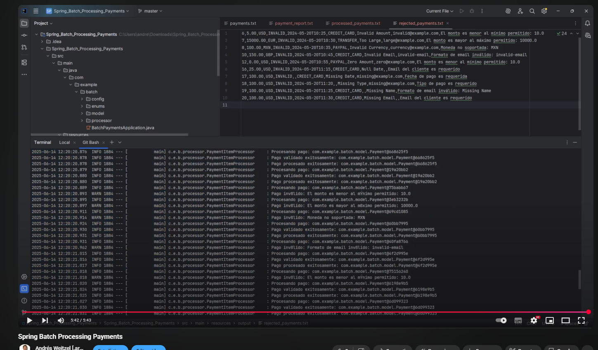

<div align = "center">
  
</div>


  <div align="right">
    
    
    
    
    
     
     
        
  </div>


<br>

<br>


<div align="right"> 
  <a href="https://github.com/andresWeitzel/Spring_Batch_Processing_Payments/blob/master/src/main/resources/static/translation/README.es.md">
    
  </a> 
  <a href="https://github.com/andresWeitzel/Spring_Batch_Processing_Payments/blob/master/README.md">
    
  </a> 
</div>

<br>

<br>

<div align="center">  

# Spring Batch Payments Processor 

</div>

This project implements a payment processor using Spring Batch that validates and processes payments from an input file, generating output files for processed payments, rejected payments, and a general report.

* [Functional tests video](https://www.youtube.com/watch?v=zPqArsLfH7o) <a href="https://www.youtube.com/watch?v=zPqArsLfH7o" target="_blank"> </a>


## Sections


<details>
<summary>1. Features</summary>

- Batch payment processing
- Amount, currency, and customer data validation
- Commission calculation
- Report generation
- Error handling and rejected payments
- Support for multiple currencies (USD, EUR, GBP, JPY)
</details>

<details>
<summary>2. Requirements</summary>

- Java 17 or higher
- Maven 3.6 or higher
- Spring Boot 2.7.0
- Spring Batch 4.3.6
</details>

<details>
<summary>3. Configuration and Execution</summary>

1. Clone the repository:
```bash
git clone [repository-url]
cd spring_batch_processing_payments
```

2. The project uses different profiles for development and production. To run in development mode:

```bash
mvn spring-boot:run -Dspring-boot.run.profiles=dev
```

</details>

<details>
<summary>4. Project Structure</summary>

```
src/main/java/com/example/batch/
├── config/         # Spring Batch configuration
├── model/          # Data models
├── processor/      # Payment processors
└── enums/          # Enumerations
```
</details>

<details>
<summary>5. Processing Flow</summary>

1. **Payment Reading**: Reads payments from `input/payments.txt`
2. **Validation and Processing**: 
   - Validates amounts (minimum: 10.00, maximum: 10000.00)
   - Validates supported currencies
   - Validates email format
   - Calculates commissions
3. **Result Writing**:
   - Valid payments → `output/processed_payments.txt`
   - Rejected payments → `output/rejected_payments.txt`
   - General report → `output/payment_report.txt`
</details>

<details>
<summary>6. File Formats</summary>

### Input File (payments.txt)
```
id,amount,currency,status,paymentDate,paymentType,customerName,customerEmail
1,100.00,USD,PENDING,2024-03-20T10:00:00,CREDIT_CARD,John Doe,john@example.com
2,500.00,EUR,PENDING,2024-03-20T10:05:00,DEBIT_CARD,Jane Smith,jane@example.com
3,1000.00,GBP,PENDING,2024-03-20T10:10:00,CREDIT_CARD,Bob Johnson,bob@example.com
4,5000.00,JPY,PENDING,2024-03-20T10:15:00,DEBIT_CARD,Alice Brown,alice@example.com
```

### Processed Payments File (processed_payments.txt)
```
id,amount,currency,status,paymentDate,paymentType,customerName,customerEmail,amountInUSD,commission,validationStatus
1,100.00,USD,PROCESSED,2024-03-20T10:00:00,CREDIT_CARD,John Doe,john@example.com,100.00,2.00,VALID
2,500.00,EUR,PROCESSED,2024-03-20T10:05:00,DEBIT_CARD,Jane Smith,jane@example.com,545.00,10.90,VALID
3,1000.00,GBP,PROCESSED,2024-03-20T10:10:00,CREDIT_CARD,Bob Johnson,bob@example.com,1270.00,25.40,VALID
4,5000.00,JPY,PROCESSED,2024-03-20T10:15:00,DEBIT_CARD,Alice Brown,alice@example.com,33.50,0.67,VALID
```

### Rejected Payments File (rejected_payments.txt)
```
id,amount,currency,status,paymentDate,paymentType,customerName,customerEmail,errorMessage
5,5.00,USD,INVALID,2024-03-20T10:20:00,CREDIT_CARD,Charlie Wilson,charlie@example.com,Amount is below minimum allowed: 10.0
6,15000.00,EUR,INVALID,2024-03-20T10:25:00,DEBIT_CARD,Diana Miller,diana@example.com,Amount exceeds maximum allowed: 10000.0
7,200.00,MXN,INVALID,2024-03-20T10:30:00,CREDIT_CARD,Edward Davis,edward@example.com,Unsupported currency: MXN
8,300.00,GBP,INVALID,2024-03-20T10:35:00,INVALID_TYPE,Frank Lee,frank@example.com,Invalid payment type: INVALID_TYPE
9,400.00,USD,INVALID,2024-03-20T10:40:00,CREDIT_CARD,Grace Kim,invalid-email,Invalid email format
10,500.00,EUR,INVALID,2024-03-20T10:45:00,DEBIT_CARD,Henry Park,,Email cannot be empty
11,600.00,GBP,INVALID,2024-03-20T10:50:00,CREDIT_CARD,Ivy Chen,ivy@example.com,Invalid or empty payment date
```

### General Report File (payment_report.txt)
```
=== Payment Processing Report ===
Processing Date: 2024-03-20T11:00:00
Total Processed Payments: 4
Total Rejected Payments: 7
Total Payments: 11

=== Currency Statistics ===
USD: 2 payments (1 processed, 1 rejected)
EUR: 3 payments (1 processed, 2 rejected)
GBP: 3 payments (1 processed, 2 rejected)
JPY: 1 payment (1 processed, 0 rejected)
MXN: 1 payment (0 processed, 1 rejected)

=== Payment Type Statistics ===
CREDIT_CARD: 6 payments
DEBIT_CARD: 4 payments
INVALID_TYPE: 1 payment

=== Rejection Reasons ===
Amount too low: 1
Amount too high: 1
Unsupported currency: 1
Invalid payment type: 1
Invalid email: 2
Invalid date: 1

=== Total Amounts ===
Total Processed (USD): 1948.40
Total Commissions (USD): 38.97
```
</details>

<details>
<summary>7. Payment Examples</summary>

### Valid Payments
1. USD payment within allowed range:
```
id,amount,currency,status,paymentDate,paymentType,customerName,customerEmail
1,100.00,USD,PENDING,2024-03-20T10:00:00,CREDIT_CARD,John Doe,john@example.com
2,500.00,USD,PENDING,2024-03-20T10:05:00,DEBIT_CARD,Jane Smith,jane@example.com
3,1000.00,USD,PENDING,2024-03-20T10:10:00,CREDIT_CARD,Bob Johnson,bob@example.com
```

2. EUR payment with valid email:
```
id,amount,currency,status,paymentDate,paymentType,customerName,customerEmail
4,500.00,EUR,PENDING,2024-03-20T11:00:00,DEBIT_CARD,Jane Smith,jane.smith@example.com
5,750.00,EUR,PENDING,2024-03-20T11:05:00,CREDIT_CARD,Alice Brown,alice.brown@example.com
6,2500.00,EUR,PENDING,2024-03-20T11:10:00,DEBIT_CARD,Charlie Wilson,charlie.wilson@example.com
```

3. GBP payment with varied amounts:
```
id,amount,currency,status,paymentDate,paymentType,customerName,customerEmail
7,50.00,GBP,PENDING,2024-03-20T12:00:00,CREDIT_CARD,David Miller,david.miller@example.com
8,200.00,GBP,PENDING,2024-03-20T12:05:00,DEBIT_CARD,Eva Garcia,eva.garcia@example.com
9,5000.00,GBP,PENDING,2024-03-20T12:10:00,CREDIT_CARD,Frank Lee,frank.lee@example.com
```

4. JPY payment with different payment types:
```
id,amount,currency,status,paymentDate,paymentType,customerName,customerEmail
10,10000.00,JPY,PENDING,2024-03-20T13:00:00,CREDIT_CARD,Grace Kim,grace.kim@example.com
11,50000.00,JPY,PENDING,2024-03-20T13:05:00,DEBIT_CARD,Henry Park,henry.park@example.com
12,100000.00,JPY,PENDING,2024-03-20T13:10:00,CREDIT_CARD,Ivy Chen,ivy.chen@example.com
```

### Rejected Payments
1. Very low amounts:
```
id,amount,currency,status,paymentDate,paymentType,customerName,customerEmail
13,5.00,USD,PENDING,2024-03-20T14:00:00,CREDIT_CARD,Jack Wilson,jack@example.com
14,1.00,EUR,PENDING,2024-03-20T14:05:00,DEBIT_CARD,Kate Brown,kate@example.com
15,0.50,GBP,PENDING,2024-03-20T14:10:00,CREDIT_CARD,Liam Davis,liam@example.com
```

2. Unsupported currencies:
```
id,amount,currency,status,paymentDate,paymentType,customerName,customerEmail
16,1000.00,MXN,PENDING,2024-03-20T15:00:00,DEBIT_CARD,Maria Garcia,maria@example.com
17,500.00,CAD,PENDING,2024-03-20T15:05:00,CREDIT_CARD,Noah Smith,noah@example.com
18,2000.00,AUD,PENDING,2024-03-20T15:10:00,DEBIT_CARD,Olivia Lee,olivia@example.com
```

3. Invalid emails:
```
id,amount,currency,status,paymentDate,paymentType,customerName,customerEmail
19,200.00,USD,PENDING,2024-03-20T16:00:00,CREDIT_CARD,Peter Davis,invalid-email
20,300.00,EUR,PENDING,2024-03-20T16:05:00,DEBIT_CARD,Quinn Wilson,not-an-email
21,400.00,GBP,PENDING,2024-03-20T16:10:00,CREDIT_CARD,Rachel Brown,missing@domain
```

4. Very high amounts:
```
id,amount,currency,status,paymentDate,paymentType,customerName,customerEmail
22,15000.00,USD,PENDING,2024-03-20T17:00:00,DEBIT_CARD,Sam Miller,sam@example.com
23,20000.00,EUR,PENDING,2024-03-20T17:05:00,CREDIT_CARD,Tina Garcia,tina@example.com
24,25000.00,GBP,PENDING,2024-03-20T17:10:00,DEBIT_CARD,Victor Lee,victor@example.com
```

5. Invalid or empty dates:
```
id,amount,currency,status,paymentDate,paymentType,customerName,customerEmail
25,100.00,USD,PENDING,,CREDIT_CARD,Will Smith,will@example.com
26,200.00,EUR,PENDING,invalid-date,DEBIT_CARD,Xena Brown,xena@example.com
27,300.00,GBP,PENDING,2024-13-45T25:61:99,CREDIT_CARD,Yara Davis,yara@example.com
```

6. Invalid payment types:
```
id,amount,currency,status,paymentDate,paymentType,customerName,customerEmail
28,100.00,USD,PENDING,2024-03-20T18:00:00,INVALID_TYPE,Zack Wilson,zack@example.com
29,200.00,EUR,PENDING,2024-03-20T18:05:00,UNKNOWN,Anna Brown,anna@example.com
30,300.00,GBP,PENDING,2024-03-20T18:10:00,,Bob Davis,bob@example.com
```
</details>

<details>
<summary>8. Implemented Validations</summary>

1. **Amount**:
   - Minimum: 10.00
   - Maximum: 10000.00

2. **Supported Currencies**:
   - USD (US Dollar)
   - EUR (Euro)
   - GBP (British Pound)
   - JPY (Japanese Yen)

3. **Email**:
   - Valid format
   - Cannot be empty

4. **Payment Date**:
   - Cannot be empty
   - ISO 8601 format
</details>

<details>
<summary>9. Reports</summary>

The system generates three types of output files:

1. **processed_payments.txt**: Contains all valid processed payments
2. **rejected_payments.txt**: Contains payments that failed validation
3. **payment_report.txt**: General report with processing statistics
</details>

<details>
<summary>10. Functionality Test</summary>

#### [Watch video](https://www.youtube.com/watch?v=zPqArsLfH7o)

  <a href="https://www.youtube.com/watch?v=zPqArsLfH7o">
    
  </a> 


</details>


<details>
<summary>11. Contributing</summary>

1. Fork the project
2. Create your feature branch (`git checkout -b feature/AmazingFeature`)
3. Commit your changes (`git commit -m 'Add some AmazingFeature'`)
4. Push to the branch (`git push origin feature/AmazingFeature`)
5. Open a Pull Request
</details>

<details>
<summary>12. License</summary>

This project is under the MIT License - see the [LICENSE](LICENSE) file for details. 
